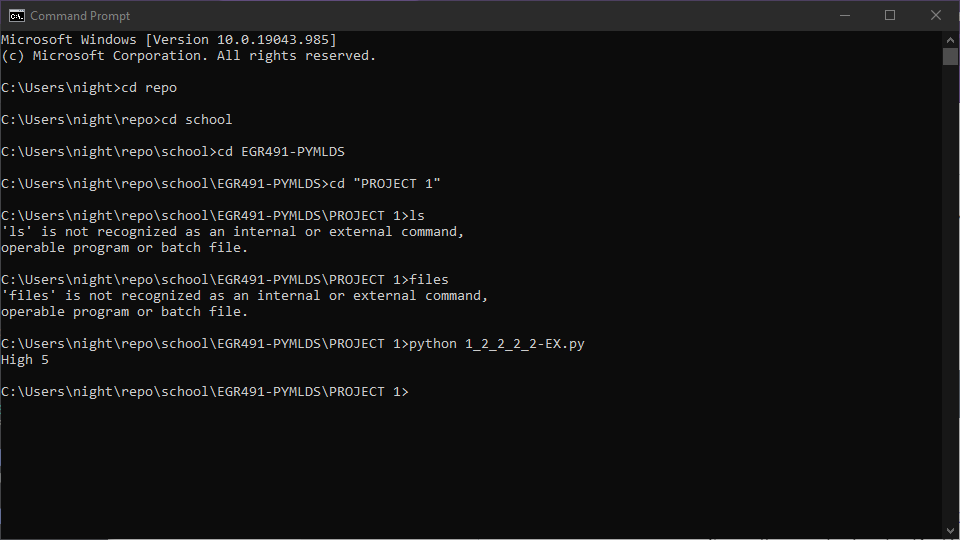
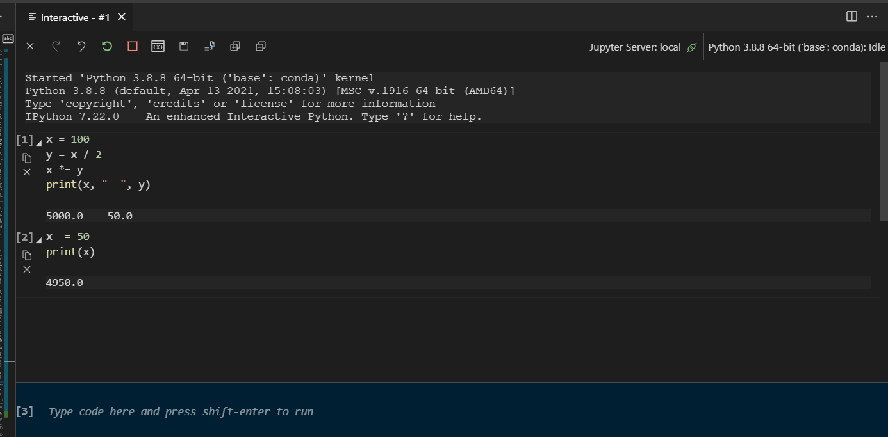

# 1. Introduction

Goal of Project:

Learn as much as possible about basic python

TABLE OF CONTENTS

1. [1. Introduction](#1-introduction)
2. [2. Examples](#2-examples)
   1. [2.1. Basic Information](#21-basic-information)
      1. [2.1.1. Building and Compiling](#211-building-and-compiling)
         1. [2.1.1.1. Command Line Python Interpreter](#2111-command-line-python-interpreter)
         2. [2.1.1.2. .py Files](#2112-py-files)
         3. [2.1.1.3. Advanced Interpreter](#2113-advanced-interpreter)
   2. [2.2. Variables](#22-variables)
   3. [2.3. Math](#23-math)

# 2. Examples

|                Need to show | How to show  |
| --------------------------: | :----------- |
|     Compiling and Debugging | Console      |
|                             | .Py File     |
|                             | Jupyter Labs |
| Basic programing Structures | Variables    |
|                             | Operations   |
|                             | Whitespace   |
|                             | imports      |
|                             | Scope        |
|             Data structures | Arrays       |
|                   Functions |              |
|                       Input |              |
|                      Output |              |

## 2.1. Basic Information

This solution simply presents the basic information of python AND will not have any asociated code.

### 2.1.1. Building and Compiling

Runing python is different to other languages because you can run python through multiple means.

#### 2.1.1.1. Command Line Python Interpreter

Python can be run in the command line. To get started type **py** into the command line.

You will then see the following text in your command line, informing you have just launched the command line python interpreter.

> Python 3.8.8 (default, Apr 13 2021, 15:08:03) [MSC v.1916 64 bit (AMD64)] :: Anaconda, Inc. on win32

> Warning:
> This Python interpreter is in a conda environment, but the environment has
> not been activated. Libraries may fail to load. To activate this environment
> please see https://conda.io/activation

> Type "help", "copyright", "credits" or "license" for more information.

If you did not see this text it is advised that you check your instalation of python.

Here you can type any line of code such as

```python
>>>print("Hello World")
Hello World
```

#### 2.1.1.2. .py Files

Another way to work with python is to write the code into a text file with the extension .py. Any .py file can be quickly read.

One example is the code below

```python
x = 0
x += 1
x *= 5
print("High", 5)

```

This will output

```
High 5
```

There are two ways to run these files,

1. Open the File in an IDE such as Juyyter Lab IDE or Visual Studio Code
   1. Right Click the file and select OPEN WITH
   2. Select the IDE of your choice
   3. These IDE's will allow you to run the file. In VSCode you will need to install the proper extension to run python files.
2. Run the files via command line.
   1. Loacte the file in command line (you can use cd < folder name > if it is not in your root direcotry)
   2. Type python < file name >
   3. A python interpreter will launch showing your output



#### 2.1.1.3. Advanced Interpreter

There are other interpreters and IDE's for python. The best of these come in the conda package which includes the Spyder IDE and Jupyter Labs interpreter.

The difference between an IDE and Interpreter when it comes to python is that the IDE is more tradional. You write your code then you run it. In an interpreter you can write and run your code line by line or in short segments. Below is an example image from the Juypter Labs extension for Visual Studio Code.



## 2.2. Variables

## 2.3. Math

In this solution we will show the basic mathmatical operations of python. This include the following:

| Operation |                  |                                                           |
| --------: | :--------------- | --------------------------------------------------------- |
|         + | Addition         | Adds the two operators                                    |
|         - | Subtraction      | Subtracts the first operator from the second              |
|        \* | Multiplication   | Multiplies the two operators                              |
|      \*\* | Power            | Raser the first operator to the second                    |
|         / | Nomal Dvision    | Divides the frist operator by the second                  |
|        // | Integer Division | Divides the first operator by the second with no remander |

---

CODE

```python

```

OUTPUT

```

```
