# Project 3: Visiualization with Matplotib

When working with large amounts of data graphing tools are rather neccesary. The python module **Matplotlib** along with the **Seaborn** module are designed to asist in data analysis.

## 1. Table of contents

1. [1. Table of contents](#1-table-of-contents)
2. [2. Table of Display](#2-table-of-display)
3. [3. Background](#3-background)
   1. [3.1. Introduction to Matplotlib](#31-introduction-to-matplotlib)
   2. [3.2. Types of plots](#32-types-of-plots)
      1. [3.2.1. Line](#321-line)
      2. [3.2.2. Scatter](#322-scatter)
      3. [3.2.3. Errorbars](#323-errorbars)
      4. [3.2.4. Contour Plots](#324-contour-plots)
      5. [3.2.5. Historgrams](#325-historgrams)
      6. [3.2.6. Bins](#326-bins)
      7. [3.2.7. Density Plots](#327-density-plots)
   3. [3.3. Styling Plots](#33-styling-plots)
      1. [3.3.1. Basic Styling](#331-basic-styling)
      2. [3.3.2. Legends, Titles and Axis Labels](#332-legends-titles-and-axis-labels)
         1. [3.3.2.1. Colorbars](#3321-colorbars)
      3. [3.3.3. Text/Annotations](#333-textannotations)
      4. [3.3.4. Special Tick Marks](#334-special-tick-marks)
      5. [3.3.5. Advanced Stlying](#335-advanced-stlying)
         1. [3.3.5.1. Configuration](#3351-configuration)
         2. [3.3.5.2. Stylesheets](#3352-stylesheets)
         3. [3.3.5.3. Subplots](#3353-subplots)
   4. [3.4. Three Dimensional Plots](#34-three-dimensional-plots)
   5. [3.5. Using Maps](#35-using-maps)
   6. [3.6. Using Seaborn](#36-using-seaborn)
4. [4. Animation](#4-animation)

## 2. Table of Display

|                  Topic | Method          |
| ---------------------: | :-------------- |
|           Simple Plots | Summary         |
|            Customizing | Summary         |
|               Subplots | Summary w/ Code |
|   Text and Annnotation | Code            |
| Advanced Customization | Code            |
|               3d Plots | Summary w/ Code |
|             Using Maps | Summary w/ Code |

## 3. Background

The Matplotlib module is based on MatLab and carries much of MatLabs ploting features. Commonly pared with Mataplot, Seaborn is an add on module to Matplotlib which makes some types of plots easier.

### 3.1. Introduction to Matplotlib

While using matplotlib it is not uncommon to use `matplotlib.pyplot` is used to simplyfy many operations. Futhermore there are two major ways to use matplotlib, _inline_ and _notebook_. These modes take advantage of IPython to make interactive graphics in line with a notebook.

To display a matplotlib plot (or Firgure) you must use `plt.show()`, unless you are using the specal methods for matplot with a notebook.

### 3.2. Types of plots

Matplotlib includes may plots including

- Line Plots
- Scatter Plots
- Histograms
- Bins
- Density Plots
- Contour plots

Below are some examples of how to use these plots.
For the sake of simplisity we will be assuming that the following lines of code have already been run.

```python
import matplotlib.pyplot as plt
import numpy as np
```

#### 3.2.1. Line

Line plots are rather simply plots taht take in two specific paramters the first is an array and the second is a numpy function on that array. It is rather simple, but more advanced features will be shown later.

```python
plt.style.use('seaborn-whitegrid')

fig = plt.figure()
ax = plt.axes()
x = np.linspace(-10, 10, 100)
ax.plot(x, 10*np.sin(x)) # You can plot on an axis
plt.plot(x, np.absolute(x), '--') # Or you can plot on the plot itself
plt.show()
```

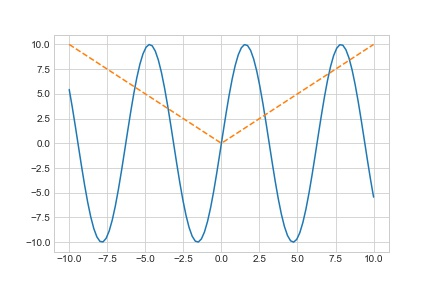

#### 3.2.2. Scatter

A scatter plot looks identical to a line plot, but it takes in two arrays, one representing the x plot and the other representing the y. Notice that this is effectivly a line plot is just a simplified scatter plot.

```python
y = np.random.random_integers(-10, 10, (100))
plt.plot(x, y)

r = 100*np.random.random(100)
clr = np.random.random(100)
plt.scatter(x, y, s=r, c=clr, cmap='viridis')
plt.show()
```

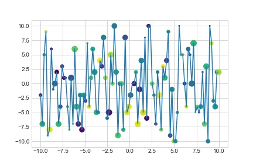

You may notice that there are more features to scatter plots than line plots which is why there is a distinction. Notice that there are three aditional paramters to the `scatter()` these are "s", "c", and "cmap" which are the Size, Color and Color map of the markers for the scatter plot. We will also discuss special markers taht can be used with the `.plot()` function in [3.3.3.1 Styling Plots](#3331-subplots).

#### 3.2.3. Errorbars

Error bars are usefult in statistics below is a quick example of how to use them.

```python

x = np.linspace(-10, 10, (5))
y = np.random.randint(-10, 10, (5))
x += np.sin(y)
#plt.plot(x, y, linestyle=':')

###########################
# Basic Error Bar
plt.errorbar(x, y, xerr=0.8, yerr=0.8, ecolor='purple',
             fmt='.k', color='blue', capsize=3)
plt.savefig('../images/basicErr.jpg')  # saving the plot as an image

##########################
# Continyous Error
plt.fill_between(x, y+0.8, y-0.8, color='red', alpha=0.5,
                 where=[True, True, False, True, True], interpolate=True)
plt.savefig('../images/contErr.jpg')
```

There are two basic types of error bars we are conerned with. The first is basic error bars common in programs such as Excel. To use these use `.errorbar()` and include the x and y data of a plot (You can add this to the same plot and simply overlay the errorbars). You can then use the parameters **yerr** and **xerr**. These values are interpreted throug aditional paramers of the Error bar plots. There are also paramters that alow you to manipulate the cap of the plot, color of the marker and the errorbars.

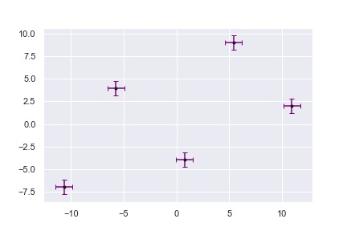

The second takes advantage of the fill between funciton. This allows you to input an x vavlue and an upper/lower y value. This will prodouse a shape with one line being the first y input and the second being the second y. This function also has parameters for which values of x should be used (where) and if you are using _where_ you can use the **interpolate** option to view potenal values.
THe ablity to interpolate can be seen in the code from above. The output file contErr.jpg which will not plot the middle x values actually apears to be ploted thanks to the Interpolate function.

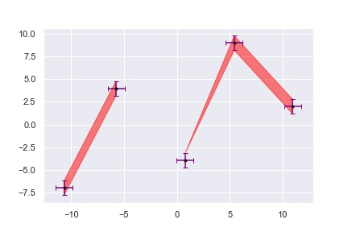

#### 3.2.4. Contour Plots

Commonly the topography of a region it is bengical to plot it on a two dimensional graph with lines marking different altidues. This can be acomplised using the contour plot

```python
def func(x, y):
    return (np.sin(x)**2 + np.cos(y)**2)


x = np.linspace(0, 10, 100)
y = np.linspace(0, 10, 100)
x, y = np.meshgrid(x, y)
z = func(x, y)
fig, ax = plt.subplots(1, 3, sharex='col', sharey='row')
ax[0].contour(x, y, z, 20, cmap='brg')
ax[1].contourf(x, y, z, 20, cmap='brg')
ax[2].imshow(z, extent=[0, 10, 0, 10], origin='lower', cmap='brg')
plt.show()
```

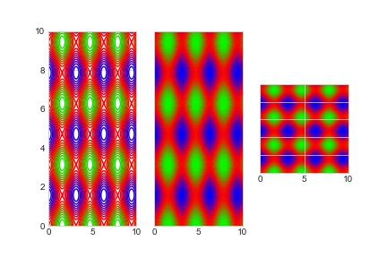

#### 3.2.5. Historgrams

When handling statistics it beomces neecsary to see how things are grouped gother, which is why we use Histograms. Below is an example historgram.

```python
data = np.random.randn(100)
fig = plt.figure()
fig, ax = plt.subplots(1, 3, sharex='col')

ax[0].hist(data)
ax[1].hist(data, bins=5)
ax[2].hist(data, bins=20, histtype='stepfilled', edgecolor='steelblue')
plt.show()
```

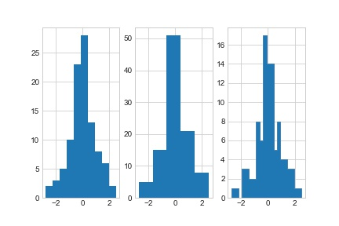

There are two things of importance in this particular plot. The first is the _bins_ attribute of histogram plots. This attribute simply list the number of bins that the plot will have. You can look at the middle graphic to notice there are only 5 bins. The second is the ability to use **subplots**, more of this will be explained later, but you may notice that I assigned each plot to an _axis_ of the plot. These can be in either a one-diemnsional or two-diemenal array.

#### 3.2.6. Bins

If you are messing with multiple statistics you can use a _Bin_ plot to work as a two dimensional histogram these are called _Bin Plots_ and can be made using the `.hist2d(xdata,ydata)` method. Bleow is an example.

```python
data_x = np.random.randint(0, 10, 10000)
data_y = np.random.randint(0, 10, 10000)
a = 0.5
plt.hist2d(data_x, data_y, cmap='RdBu', bins=2, alpha=a)
plt.hist2d(data_x, data_y, cmap='RdGy', bins=4, alpha=a)
plt.hist2d(data_x, data_y, cmap='RdBu_r', bins=8, alpha=a/2)
plt.hist2d(data_x, data_y, cmap='RdGy_r', bins=16, alpha=a/2)
plt.show()
```

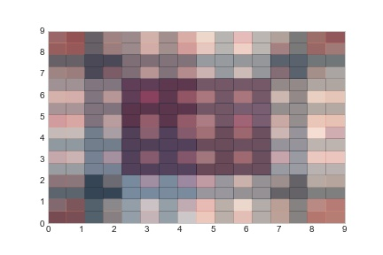

Notice that I have included both the _alpha_ paramater. This allows you to clearness to plots that are over eachother.

#### 3.2.7. Density Plots

You may have noticed that our contour plot is that it is rather choppy. This is where _density_ plots come in handy. These require the use of a KDE plots.

One of KDE plost comes from the _scipy.stats_ the **guasian_kde** is capable of populating a smotther girdas compared to the coutour or contourf plots.

```python
from scipy.stats import gaussian_kde
data_x = np.random.randn(10000)
data_y = np.random.randn(10000)*2
data_x = np.sin(data_x*np.pi)
data_y = np.cos(data_y*np.pi)
data = np.vstack([data_x, data_y])
kde = gaussian_kde(data)

xgrid = np.linspace(-1, 1, 100)
ygrid = np.linspace(-1, 1, 100)
Xgrid, Ygrid = np.meshgrid(xgrid, ygrid)
Z = kde.evaluate(np.vstack([Xgrid.ravel(), Ygrid.ravel()]))
plt.imshow(Z.reshape(Xgrid.shape),
           origin='lower', aspect='auto',
           extent=[-1, 1, -1, 1],
           cmap='coolwarm')
plt.show()
```

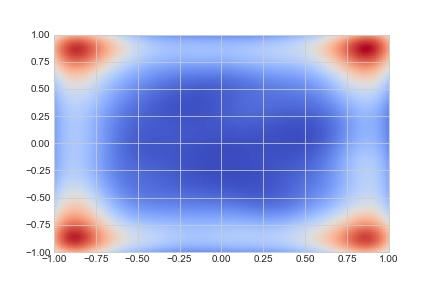

There are a few things. You may notice about this plot. The first is that it uses `.imshow()`. This means that this plot is more of an image and can be thus be expanded by increasing the array in the parameter _extent_.

### 3.3. Styling Plots

A plot is only as good as your ability to make it appear nice. May companies will use standard styles which may not fit with the common styles of matplotlib. Thus there are many ways to cusimize plots.

#### 3.3.1. Basic Styling

The first thing to know about plots is knowing how to use basic stlying. These paramters include

- alpha: Takes a Float value between 0 to 1 that includes
- linestyle: The style of the line below is a simple table to show the funtinoality
  - | Symbol | Type      |
    | ------ | --------- |
    | '-'    | solid     |
    | '--'   | dashed    |
    | '-.'   | dashdoted |
    | ':'    | dotted    |
- label: Takes a lable for the plot

These are a few of the major functions and others can be used

#### 3.3.2. Legends, Titles and Axis Labels

Many engineers have lothed the one time they forgot to add a label or title to their plot in a pyhsics class. Therefore matplotlib does include methods to add these feature. These features do depend if you are working with the plot of with the plots axes. Below is a table of these functions.

| Plot Function |   Axis Method | Function                    |
| ------------: | ------------: | :-------------------------- |
|     .legend() |     .legend() | Sets the legend of the plot |
|     .xlabel() | .set_xlabel() | Sets the x axis label       |
|     .ylabel() | .set_ylabel() | Sets the y axis label       |
|       .ylim() |   .set_ylim() | Set the y axis limits       |
|       .xlim() |   .set_xlim() | Set the x axis limits       |
|      .title() |  .set_title() | Sets the plots title        |

In adition to these function the Axis object has the `.set()` function which takes parameters to fillout a plots inforation. These parameters are:

- title: Plots title
- xlim: Set the x limit
- ylim: Set the y limit
- xlabel: set the x label
- ylabel: set the y label

Sometimes you want to work directly with a legend. The .leged function can take the following paramters

- frameon: Takes a boolean of if the legend has a frame
- loc: Takes strings for the location including 'upper left', 'lower right' and other simlar combinations
- ncol: number of columns in the legend
- nrow: number of rows in teh colun
- facnybox: boolean of if the frame should have a rounded edge
- borderpad: legend frame border thickness
- shadow: if the legend should have a shadow

In adition to setting the style of the legend you can select the lines on the plot and even give them a name. Below are two methods to do this

```python
### MANIPULATION OF THE LEGEND OBJECT
y = np.sin(x[:, np.newaxis] + np.pi * np.arange(0, 2, 0.5))
lines = plt.plot(x, y)

# lines is a list of plt.Line2D instances
plt.legend(lines[:2], ['first', 'second']);


####
#ADDING LABELS TO THE PLOTS
plt.plot(x, y[:, 0], label='first')
plt.plot(x, y[:, 1], label='second')
plt.plot(x, y[:, 2:])
plt.legend(framealpha=1, frameon=True);
```

##### 3.3.2.1. Colorbars

You can modify colorbars for contour, or bin plots. The easy way is to set your plots cmap as shown in other areas, but you make the colorbars descret. This can be done by adding the _ticks_ paramer when adding a colorbar throug `plt.colorbar()`

Here is an example

```python
data_x = np.random.randint(0, 10, 10000)
data_y = np.random.randint(0, 10, 10000)
a = 0.5
color_map = plt.cm.get_cmap('RdBu', 5)
plt.hist2d(data_x, data_y, cmap=color_map, bins=16, alpha=a)
plt.hist2d(data_x, data_y, cmap=color_map, bins=8, alpha=a)
plt.hist2d(data_x, data_y, cmap=color_map, bins=4, alpha=a)
plt.hist2d(data_x, data_y, cmap=color_map, bins=2, alpha=a)
plt.colorbar(ticks=range(5), label='5 colors :)')
plt.clim(-0.5, 0.5)
plt.savefig('../images/clrbar.jpg')
```

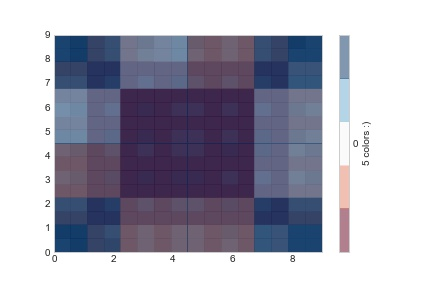

#### 3.3.3. Text/Annotations

Text can be added to any point on a subplot using the `.text()` function of the axis or plot objects.
This method takes the x and y position of where you would like your text to be place followed by the text to be inserted.

```python
fig, ax = plt.subplots(facecolor='yellow')
ax.axis([-1, 1, -1, 1])
ax.text(0, 0, '.  Origin')
ax.text(0, 0, '. Bottom Corner', transform=ax.transAxes)
ax.text(0.5, 0.5, 'Origin 2 .',  transform=fig.transFigure, ha='right')

plt.savefig('../images/text.jpg')
ax.axis([-2, 2, -1, 2])
ax.annotate('NOTICE \n That Origin did not move',
            xy=(0, 0), xytext=(1, 1),
            arrowprops=dict(facecolor='black', shrink=1.5))
plt.savefig('../images/text2.jpg')
```

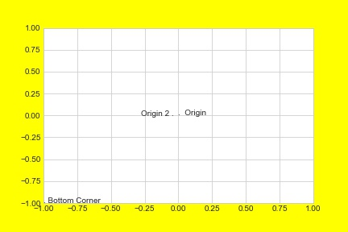
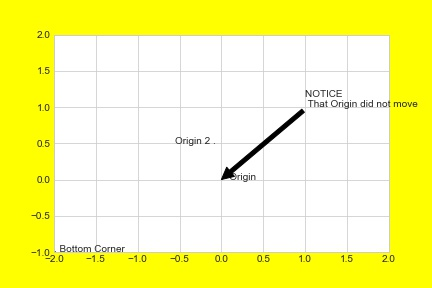

#### 3.3.4. Special Tick Marks

Matplotlib graphics can use four differenct scales on both the x and y axis. This is typically used when assigint the `plt.axes()` by using _xscale_ and _yscale_. But you can also use `plt.yscale()` and `plt.xscale()`.

These scales are

- linear
- logrithmic
- symlob
- logit

and can be assigedto either the x or y axis.

You can also ajust the number/ stlying.

To elimnate your plots use the .set_minor_locator and .set_major_locator.
This can be done easily by assing a plots axis and accessing the axis.xaxis/yaxis.

To delete the x/y axis lables input plt.Nulllocator() to .set_major/minor_locator) and to set the maximum number of ticks use plt.MaxNLocator(Ticks). To set the frequency of ttick input the plt.MultipleLocator(value).

Finally when manipulating the tick marks of a plot you can use the function .set_major_formatter(plt.FuncFormatter(function)).

#### 3.3.5. Advanced Stlying

##### 3.3.5.1. Configuration

If is often undesireable to edit several plots in one program. This can be solved by chaning the default values of matplotlibs using plt.rc().
The first parmeter this function takes is the string name of the parmeter you wish to change and is then followed by a list of parameters for that section. These can be found within the matplotlib documentation
[documentation](https://matplotlib.org/stable/tutorials/introductory/customizing.html).

##### 3.3.5.2. Stylesheets

When working for a major cooperation there are oftne deaults the company wishes to use. These can be stored in a stylesheet for rapid and convient access. This only works with predefined styles from [matplotlib](https://matplotlib.org/stable/gallery/style_sheets/style_sheets_reference.html).

##### 3.3.5.3. Subplots

There are two ways to add multiple plots to a plot. The first is to use subplots. This can be does by either asising different axes to a list of objects like this:

```python
ax1 = plt.axes()
ax2 = plt.axes([0.5,0.5,0.5,0.5]) # Makes a subplot inside this plot
```

You can also use the `.add_axes` functino of a figure object. The function takes a size four array telling you the positoni an size of the subplot. The first two are for the position of the plot from the bottom left side. The other two terms detrmin its width and height respectivly.

To add a plot to a subplot you must use an axis object.

An easier method to making subplots is using the `.subplot()` method of a plot. This parameter takes the _number of rows_, _number of columns_, and the _plot index_. To adjust formating of the subplots use the `.subplots_adjust()` functions.

The final form of subplots uses the `.GridSpec()` function of a plot. This function takes in the same set of parameters as the `.subplot()` function, but that does not make the plots.

To make a plot while using `.GridSpec()` you must use `pllt.subplot()` followed by the grid indecies. This allows you to have graphics that are varies in size.

Below is an advaced example of how to use `.GridSpec()`

```python

# Create some normally distributed data
mean = [0, 0]
cov = [[1, 1], [1, 2]]
x, y = np.random.multivariate_normal(mean, cov, 3000).T

# Set up the axes with gridspec
fig = plt.figure(figsize=(6, 6))
grid = plt.GridSpec(4, 4, hspace=0.2, wspace=0.2)
main_ax = fig.add_subplot(grid[:-1, 1:])
y_hist = fig.add_subplot(grid[:-1, 0], xticklabels=[], sharey=main_ax)
x_hist = fig.add_subplot(grid[-1, 1:], yticklabels=[], sharex=main_ax)

# scatter points on the main axes
main_ax.plot(x, y, 'ok', markersize=3, alpha=0.2)

# histogram on the attached axes
x_hist.hist(x, 40, histtype='stepfilled',
            orientation='vertical', color='gray')
x_hist.invert_yaxis()

y_hist.hist(y, 40, histtype='stepfilled',
            orientation='horizontal', color='gray')
y_hist.invert_xaxis()
```

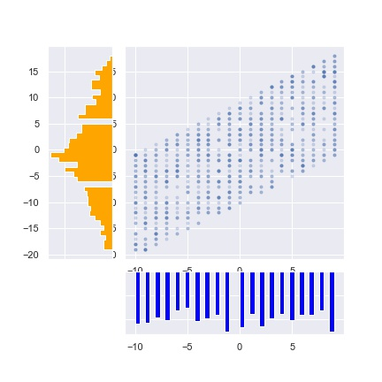

### 3.4. Three Dimensional Plots

You can graph three demensionally with matplotlib. _Plots_, _contourplots_, and _scatter_ are the most common of these and work similarly to their two deimsional counters.

Below are examples of how to make these

```python
ax = plt.axes(projection='3d')
x = np.linspace(0, 100, 100)
y = np.sin(x)
z = np.sin(2*x) - np.arcsin(y)

ax.plot3D(x, y, z, 'Blue')
y *= 2
ax.scatter3D(x, y, z, c=y, cmap='binary')
plt.savefig('../images/3d-plt.jpg')
```

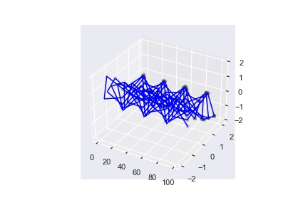

```python
def f(x, z):
    return np.sin(x)**2 + np.cos(z)**2


x = np.linspace(-10, 10, 100)
z = np.linspace(-10, 10, 100)

X, Z = np.meshgrid(x, y)
Y = f(X, Z)
fig = plt.figure()
ax = plt.axes(projection='3d')
ax.contour3D(X, Y, Z, 100, cmap='plasma')
plt.savefig('../images/contour3d.png')
```

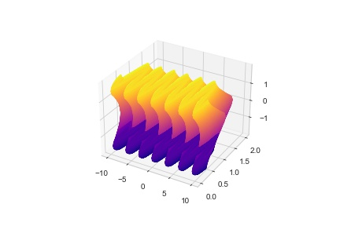

### 3.5. Using Maps

In the case you wish to use actually data on a map the modules basemap can come in handy. This module allows you to print maps of the world from multiple perspetives and even can include various boundaries.

### 3.6. Using Seaborn

Fiannly we some to seaborn. This modernized version of matplot lib adds a few simplifying features. This also gives the ability to make more complex plots such as the _join_ plot which allows you to plot a two dimensional histogram AND the histograms for the plots on either side. Below is a simple program that outputs some of these graphics.

```python
x = np.linspace(0, 10, 100)
y = np.sin(x)

plt.plot(x, y)

sns.set()  # Activates seaborn
plt.plot(x, y)
plt.savefig('..\images\sns-plt.jpg')
plt.clf()  # Clears the figure
plt.cla()  # Clears the Axis
# HISTOGRAMS
data = np.random.randint(0, 10, (1000, 2))
data = pd.DataFrame(data, columns=['x', 'y'])

for col in 'xy':
    plt.hist(data[col], alpha=0.5)

plt.savefig('..\images\sns-hist.jpg')
# Smooth HIstograms
plt.clf()
plt.cla()
for col in 'xy':
    sns.kdeplot(data[col], shade=True)

plt.savefig('..\images\sns-hist-kde.jpg')

# DIstplots
plt.clf()
plt.cla()
sns.displot(data['x'])
sns.distplot(data['y'])

plt.savefig('..\images\sns-dist-kde.jpg')

# KDE Plots
plt.clf()
plt.cla()
sns.kdeplot(data['x'], data['y'])
plt.savefig('..\images\sns-kde.jpg')
sns.jointplot("x", "y", data, kind='kde')
plt.savefig('..\images\sns-join-kde.jpg')
sns.jointplot("x", "y", data, kind='hex')
plt.savefig('..\images\sns-join-hex.jpg')

# Pair plots
plt.clf()
plt.cla()
sns.pairplot(sns.load_dataset('iris'), hue='species', size=1)
plt.savefig('..\images\sns-pair.jpg')

```

The images below are provided as the were saved in the proceding program.
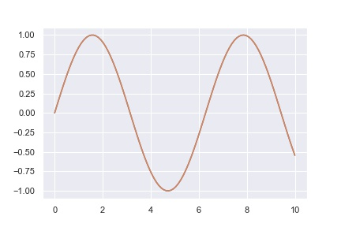
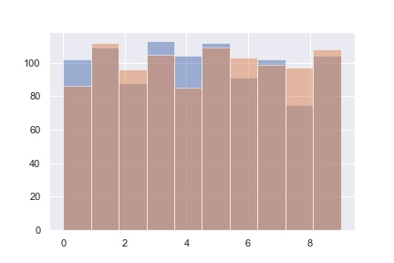
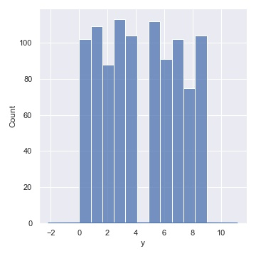
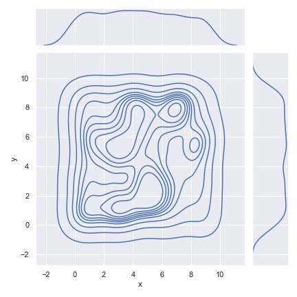
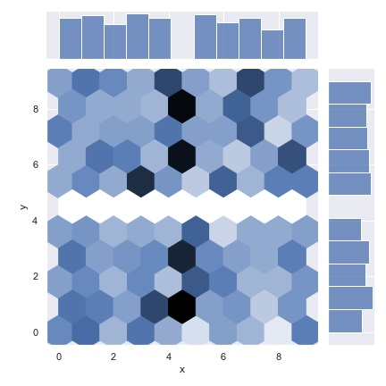
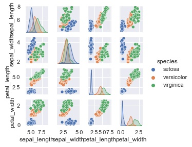

## 4. Animation

Although it exceeds the bounds of this course. The animation ability in matplotlib is can be useful. This is a complex subject, but below is a simple example.

```python
import matplotlib.pyplot as plt
import numpy as np
import matplotlib.animation as anim
from matplotlib.animation import FuncAnimation
fig = plt.figure()
data_x, data_y = [], []

plt.xlim(-10, 10)
plt.ylim(-10, 10)


def anim_func(i):
    for j in range(0, 10):
        data_x.append(np.random.randint(-10, 10))
        data_y.append(np.random.randint(-10, 10))

    if(i % 10 == 0):
        print(i)

    plt.hexbin(data_x, data_y, cmap='Reds', gridsize=2*((i//10)+1))


ani = FuncAnimation(fig, anim_func, interval=1, save_count=300, repeat=False)
f = r"./test_ani.gif"
print(f)

writergif = anim.PillowWriter(fps=30)
ani.save(f, writer=writergif)
print("saved")

```


It should also be noted it does take a rather long time for these animations to load. For this it took my computer around to minutes for a total of 300 frames.
