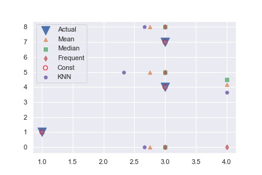
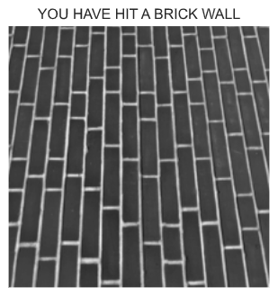
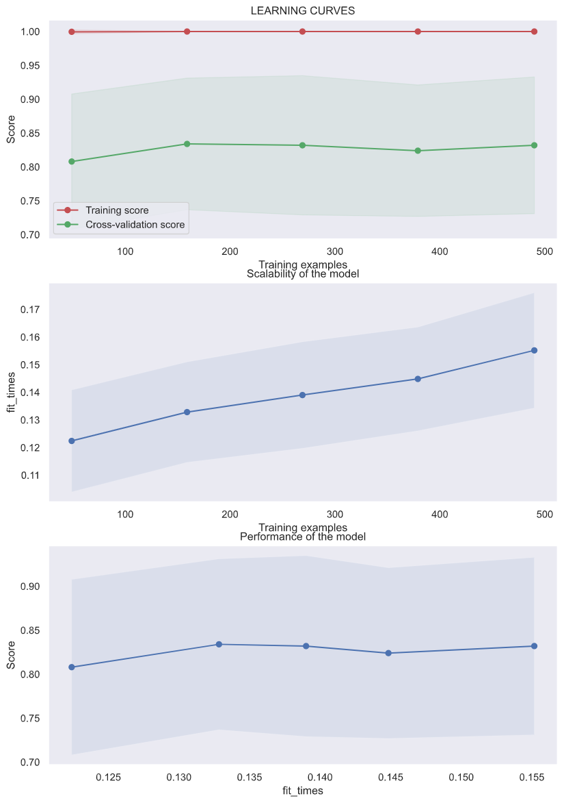
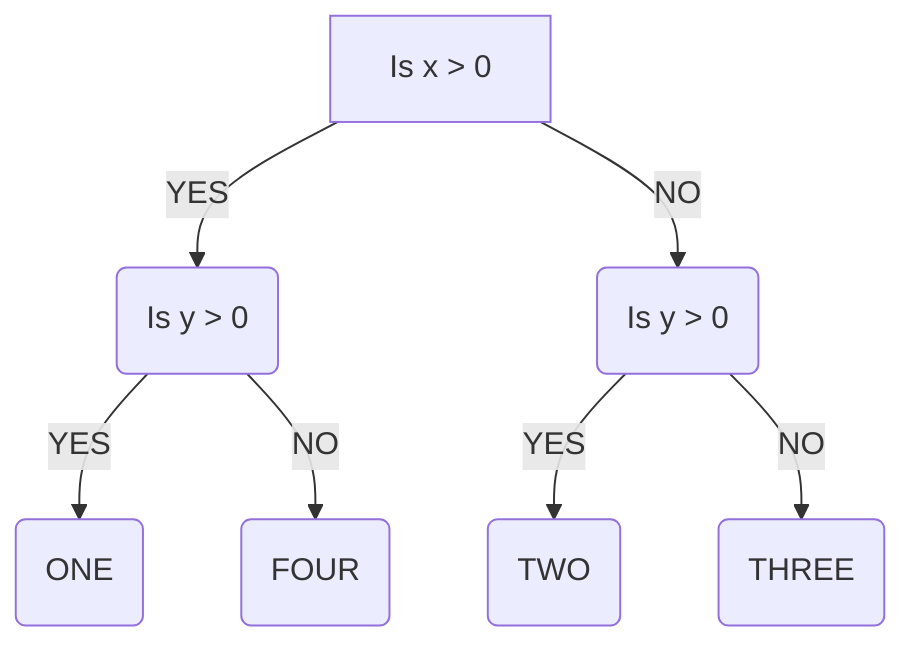
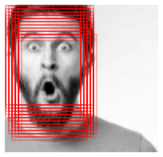

# Project 5: Making an AI

## 1. Table of Display

|                                Topic | Method         |
| -----------------------------------: | :------------- |
|                           What is ML | Summary        |
|                Intro to Scikit-Learn | Summary w/Code |
| Hyperparameters and Model Validation | ?              |
|                  Feature Engineering | ?              |
|            DTrees and Random Forests | ?              |
|              Face Detection Pipeline | Final Project  |

## 2. Table Of Contents

1. [1. Table of Display](#1-table-of-display)
2. [2. Table Of Contents](#2-table-of-contents)
3. [3. Background](#3-background)
   1. [3.1. What is Machine Learning?](#31-what-is-machine-learning)
      1. [3.1.1. Supervised learning](#311-supervised-learning)
         1. [3.1.1.1. Classification](#3111-classification)
         2. [3.1.1.2. Regression](#3112-regression)
      2. [3.1.2. Unspervised Learning](#312-unspervised-learning)
         1. [3.1.2.1. Clustering](#3121-clustering)
         2. [3.1.2.2. Dimensionality Reduction](#3122-dimensionality-reduction)
   2. [3.2. Scikit-Learn](#32-scikit-learn)
      1. [3.2.1. Data Structure](#321-data-structure)
      2. [3.2.2. Imputation: Filling Missing Data](#322-imputation-filling-missing-data)
   3. [3.3. Feature Engineering: What are we working with?](#33-feature-engineering-what-are-we-working-with)
      1. [3.3.1. Categorical Data](#331-categorical-data)
      2. [3.3.2. Language Features](#332-language-features)
      3. [3.3.3. Image Featuers](#333-image-featuers)
      4. [3.3.4. Derived Features](#334-derived-features)
   4. [3.4. Picking a Model: What will you use?](#34-picking-a-model-what-will-you-use)
      1. [3.4.0.1. Hyperparemters](#3401-hyperparemters)
      2. [3.4.0.2. Validation](#3402-validation)
      3. [3.4.0.3. Picking The Best Model](#3403-picking-the-best-model)
   5. [3.5. Piplines](#35-piplines)
   6. [3.6. Special Topic: Random Forests](#36-special-topic-random-forests)
4. [4. Project: Face Detection Pipeline](#4-project-face-detection-pipeline)
   1. [4.1. Output](#41-output)
   2. [4.2. Code](#42-code)

## 3. Background

### 3.1. What is Machine Learning?

Machine Learning (ML) is the art of designing mathematical models of data that can be taught via tunable parameters. Because these algorithms are designed to asist in understanding data, there can be some debate of whether ML could be considered a branch of Artificial Intelligence (AI) anymore.

Because ML works with big data which vary greatly in both size, complexity there must also be various methods of analizing this data. The two general categories of ML are **Supervised** and **Unsupervised** learning. We will explorw these methods futher in this paper.

#### 3.1.1. Supervised learning

Supervised learning takes data and labels associated with the data to model their relationship. This ML model is used to apply labels to novel data. Supervised learning is commonly subdivided into **classification** and **regression**.

##### 3.1.1.1. Classification

Classification models use descrite categories such as a status. This type of model may be used to identify objects in an image or seek for when a part might be damaged within a piece of machinery.

This model will require the devleoper to fist make a labeled dataset. Then you must design model inputs and the general assumptions your can provide. After this you can provide a set of model paramters which can be adjusted by the model during the training stage. The end requlst is that when introduced to novel data the classical model will provide a predictive label.

##### 3.1.1.2. Regression

Regression models place their categories in a continuous spectrums. This can be used to seek the pobablity of damage to an piece of machinery or seek more complex relationships such as genetics to regions.

Regression models could be treadted as the oposite of [Demensionality Reduction](#3122-dimensionality-reduction) models. They will extract a new unknown relationship and create a new dimesion of labels.

#### 3.1.2. Unspervised Learning

Unsuprvised learning results from not having a labeled dataset. This type of learning is used to find relationships within a data set. Unspervised Learning can be further subdivided into **Clustering** and **Demensitionaly Reduction** models.

##### 3.1.2.1. Clustering

Clustering models act simlarly to classification models exceept they are seeking the distinct groups with the dataset. This can be used to seekout groups within massive datasets that humans may never see.

One method to do clustersing is through the _k_-means fits model. This method finds the center of data clusters, it must be profivided with a value _k_ or this value may be tunable. This model seeks the postion of centers that has the minimum distance between all points in the dataset.

##### 3.1.2.2. Dimensionality Reduction

Demensionality Reduction as its name suggests is designed to simpfly a data set into the smalled scturcure possible. This type of model could be used to seek important parameters to watch in larger systems which may take years for a human to analyze. This method allows us to infer new strutures that may not be labels (or may not exist).

A demnstionality reduction model typcially will remove one or more of the layers of data. This could be used to review a large dataset and place the data neatly into graphs that huamns and easily understand, interpret and apply.

### 3.2. Scikit-Learn

While developing a ML algrithem from scratch is possible it could be cumbersom and likly has already been done. Thus to prevent reinventing the wheel, you can use the modeule **Scikit-Learn**. Scikit-Learn contains many of the popular algorithems in one consitent API.

Designed by a group of Cornell University students, Scikit-Learn is intended to be a new user friendly API which can also be useful for experts in the field. To this end Scikit-Learn features <ins>consistent</ins> usage, <ins>inspecettable</ins> attributes, <ins> simplistic</ins> set of classes, and <ins> senible defaults </ins> for all classes.

#### 3.2.1. Data Structure

Scikit-Learn descibes data with a _features matrix_ this matrix can be stored in a NumPy array or Pandas DataFrame. The rows of the features matrix are often called sameles and the columns are considered features. Thus the features matrix is considered to have the shape `[n_samples, n_features]`.

The features matrix is then coupled with a _label array_. This array is typically is a Numpy array or Pandas Series of n_samples, but it can be two-dimesional with the shapre [n_smaple, n_targets]. The label array could be considered the dependent variable the model is attempting to predict.

#### 3.2.2. Imputation: Filling Missing Data

In an ideal world we would have all the data avalible to us perfectly setup and ready to be used. This is rarly the case. To make filling in data smoother sklearn includes the _Imputer_ class. This class uses various stregies to fill you datasheets.

To use the Imputer class use:

---

```python
from sklearn.impute import SimpleImputer
```

---

Then you can assign the imputer to a variable and use the `.giy_transform()` function. As seen in the example below

```python
### IMPUTATION HOW TO ###
# %%
import matplotlib.pyplot as plt
import numpy as np
import seaborn as sns
from numpy import nan
from sklearn.impute import SimpleImputer
from sklearn.impute import KNNImputer

data_main = np.array([[nan, 0,   3],
                      [3,   7,   9],
                      [nan,   5,   nan],
                      [4,   nan, 6],
                      [nan,   8,   1],
                      [1, 1, 1],
                      [3, 4, 9]])
imp = SimpleImputer(strategy='mean')
data_mean = imp.fit_transform(data_main)
imp = SimpleImputer(strategy='median')
data_median = imp.fit_transform(data_main)
imp = SimpleImputer(strategy='most_frequent')
data_freq = imp.fit_transform(data_main)
imp = SimpleImputer(strategy='constant', fill_value=2)
data_const = imp.fit_transform(data_main)
imp = KNNImputer(n_neighbors=3)
data_KNN = imp.fit_transform(data_main)
# %%
print(data_main)
print('--------------')
print(data_mean)
print('--------------')
print(data_median)
print('--------------')
print(data_freq)
print('--------------')
print(data_const)
print('--------------')
print(data_KNN)

# %%
sns.set()
plt.scatter(data_main[:, 0], data_main[:, 1],
            marker='v', label='Actual', s=200)
plt.scatter(data_mean[:, 0], data_mean[:, 1],
            alpha=0.75, label='Mean', marker='^')
plt.scatter(data_median[:, 0], data_median[:, 1],
            alpha=0.75, label='Median', marker='s')
plt.scatter(data_freq[:, 0], data_freq[:, 1],
            alpha=0.75, label='Frequent', marker='d')
plt.scatter(data_main[:, 0], data_main[:, 1], marker='.',
            label='Const', edgecolors='red', facecolors='none', s=200)
plt.scatter(data_KNN[:, 0], data_KNN[:, 1],
            marker='p', label='KNN')

plt.legend()

plt.savefig('..\images\IMPUTATION.jpg')
```



There are four methods that you can use with a normal imputer.

- Mean: Fills the mean of the column within a numerical dataset
- Median: Fills the median of the column within a numerical dataset
- Most Frequent: Fills the most freqent value within the dataset.
- Constant: Fills a constatnt provided in `fill_value`

There is also a newer imputer you may have notied in the code. This is the KNNImputer or k_nearest neighbors imputer. This imputer uses the k-Nearest Neighbors algorithm to estiamte a value. You can set the number of neighbors using the `n_neighbors` parameter.

Their is a experamental imputer known as the IterativeImputer which you can find in the [scikit-learn API](https://scikit-learn.org/stable/modules/generated/sklearn.impute.IterativeImputer.html#sklearn.impute.IterativeImputer).

### 3.3. Feature Engineering: What are we working with?

Another import part of preparing data for your model requires building features. This is becuase data provided rarly has a clear division of features to sample making it hard to design the features matrix. The art of filling out the features of a dataset is called **feature engineering**.

First we must acknolege a few types of features:

- _Categoical Data_: This data deals with categories of the data such as the if a person is tall or short
- Text or Lange Features: These features are considered with the words within a dataset. This particualar feature is common in social media and is the bane of youtubers.
- Image Feature: These features are specific to images such as position and color.

#### 3.3.1. Categorical Data

Sklearn does have a few useful features when conducting _vectorization_. When working with categorical data you can use a **DictVecorizer**. This will allow you to seek the features rather quickly.

```python
# %%
from sklearn.feature_extraction import DictVectorizer
data = [{'power': 100, 'usage': 31, 'type': 'development'},
        {'power': 5, 'usage': 23, 'type': 'development'},
        {'power': 35, 'v': 37, 'type': 'gameing'}]

v = DictVectorizer(sparse=False)
X = v.fit_transform(data)
print('----------------')
print(X)
print('----------------')
print(v.inverse_transform(X))
print('----------------')
print(v.transform({'power': 33, 'usage': 21, 'type': 'gameing'}))

# %%
```

OUTPUT

---

      from sklearn.feature_extraction import DictVectorizer...
      ----------------
      [[100.   1.   0.  31.]
      [  5.   1.   0.  23.]
      [ 35.   0.   1.  37.]]
      ----------------
      [{'power': 100.0, 'type=development': 1.0, 'usage': 31.0}, {'power': 5.0, 'type=development': 1.0, 'usage': 23.0}, {'power': 35.0, 'type=gameing': 1.0, 'usage': 37.0}]
      ----------------
      [[33.  0.  1. 21.]]

---

You can retrive a DictVectorizer's feature names through the function `.get_feature_names()`. If we run that on our example we get
['power', 'type=development', 'type=gameing', 'usage']

#### 3.3.2. Language Features

Language Features focus on word counts or how many times a specific word occurs within a dataset. ALthough you could do this by hand sklearn provided the effiecent class called **CountVecorizer**. This can take a sequence of items, or text file to tokenize the strings.

As an example we will use the descriptions of these youtube videos [EGR491-SAMPLE_DATA](https://youtube.com/playlist?list=PLZK8Egerqxghhe0xH6_kLpGWg2x8zTgXi).

```python
# %%
import pandas as pd
from sklearn.feature_extraction.text import CountVectorizer
f = open(
    '..\CODE\INPUT\COUNTVEC_TEST.txt', 'r')
content = f.read()
content = str.split(content, '>')
cv = CountVectorizer()
fit = cv.fit_transform(content)
wordBYword = pd.DataFrame(fit.toarray(), columns=cv.get_feature_names())
# %% VECTORIZE BY 2-5 WORD SEQUENCE
cv2 = CountVectorizer(ngram_range=(2, 5), analyzer='word')
fit = cv2.fit_transform(content)
twoToFive = pd.DataFrame(fit.toarray(), columns=cv2.get_feature_names())
print(wordBYword)
print(twoToFive)

```

---

         also  always  as  asmr  be  beats  believe  communicate  computers  \
      0     0       0   0     0   1      0        1            0          2
      1     0       0   0     0   1      0        0            0          0
      2     1       1   1     1   0      1        0            1          0

         decoder  ...  this  to  transmit  using  via  video  watch  we  will  you
      0        0  ...     1   0         0      0    0      1      0   0     2    1
      1        0  ...     1   0         0      0    0      0      0   1     1    0
      2        1  ...     1   3         1      1    1      1      1   0     2    3

      [3 rows x 55 columns]
         also show  also show you  also show you how  also show you how to  \
      0          0              0                  0                     0
      1          0              0                  0                     0
      2          1              1                  1                     1

         always to  always to some  always to some nice  \
      0          0               0                    0
      1          0               0                    0
      2          1               1                    1

         always to some nice musical  as always  as always to  ...  \
      0                            0          0             0  ...
      1                            0          0             0  ...
      2                            1          1             1  ...

         you how to communicate  you how to communicate using  you know  \
      0                       0                             0         0
      1                       0                             0         0
      2                       1                             1         1

         you know the  you know the thing  you know the thing that  you watch  \
      0             0                   0                        0          0
      1             0                   0                        0          0
      2             1                   1                        1          1

         you watch mrbeast  you watch mrbeast or  you watch mrbeast or pewdiepie
      0                  0                     0                               0
      1                  0                     0                               0
      2                  1                     1                               1

      [3 rows x 278 columns]

---

You may have notice that this model tends to weigh popular words in these video descriptinos such as "also" or "you". This is where the **Tfidfvectorizer** comes in handy. Lets look at a similar example with TfidVectorizer instead.

```python
# %%

import pandas as pd
from sklearn.feature_extraction.text import TfidfVectorizer
f = open(
    '..\CODE\INPUT\COUNTVEC_TEST.txt', 'r')
content = f.read()
content = str.split(content, '>')
cv = TfidfVectorizer()
fit = cv.fit_transform(content)
wordBYword = pd.DataFrame(fit.toarray(), columns=cv.get_feature_names())
print(wordBYword)

# %%

```

---

            also    always        as      asmr        be     beats   believe  \
      0  0.000000  0.000000  0.000000  0.000000  0.211054  0.000000  0.277511
      1  0.000000  0.000000  0.000000  0.000000  0.179873  0.000000  0.000000
      2  0.140933  0.140933  0.140933  0.140933  0.000000  0.140933  0.000000

         communicate  computers   decoder  ...      this        to  transmit  \
      0     0.000000   0.555021  0.000000  ...  0.163902  0.000000  0.000000
      1     0.000000   0.000000  0.000000  ...  0.139688  0.000000  0.000000
      2     0.140933   0.000000  0.140933  ...  0.083237  0.422798  0.140933

            using       via     video     watch        we      will       you
      0  0.000000  0.000000  0.211054  0.000000  0.000000  0.327805  0.211054
      1  0.000000  0.000000  0.000000  0.000000  0.236512  0.139688  0.000000
      2  0.140933  0.140933  0.107183  0.140933  0.000000  0.166474  0.321549

      [3 rows x 55 columns]

---

#### 3.3.3. Image Featuers

Image proccessing is rather difficult as it has a low of data. An example is if you had a 256px by 256px image. Each of the pixels has a color value (usally 4 digits representing red, green, blue and alpha), and positon value. This would be very tedious luckally there is Scikit-image which can analize this images for us. Below is a short example of how to use this module.

```python
# %% SKIMAGE_TEST
import os
import matplotlib.pyplot as plt
import numpy as np
import seaborn as sns
import skimage.data
from skimage import color, data, feature

sns.set()


image = color.rgb2gray(data.brick())
plt.axis('off')
plt.imshow(image, cmap='gray')
plt.title('YOU HAVE HIT A BRICK WALL')
```



You may notice that Scikit-image works as both a image analyzer and manipulator. This feature through will be expalin further in the [Application](#4-project-face-detection-pipeline) section of this project.

#### 3.3.4. Derived Features

Derieved Features are purly numerical features. Scikit-learn treat all numical feature inputs as derived features by deafult, but there is more than you can do. These can be infered with common models like **LinearRegression** and **PolynomialFeatures**.

### 3.4. Picking a Model: What will you use?

Now that we have clean data we are able to pick a class of model we wish to use. From the (Scikit-learn API)[https://scikit-learn.org/stable/modules/classes.html] you can find all classes of models. You class should include what type of information you wish to get, and what information you have.

After you have chose your model class there are two things you must do next. You must select your **hyperparamters** or the "knobs" which your ML algorthm can adjust, and you must **validate** your model.

##### 3.4.0.1. Hyperparemters

Hyperparemtesr are what makes a ML algorthim tick. These are specific to a model. Forinstance the _KNeighborsClassifier_ has a parameter _n_neighbors_ while the _PolynomicalFeatures_ model has a _degree_ features.

These parameters will determin how your algorithm will solve the problems and will be fill out when instantiating the model.

##### 3.4.0.2. Validation

Once you have selected your hyperparametes you must make a decision if you could improve the estimations. This is where model validation begins to work.

The first rule of model validation is that your model **cannot** be trained on the same data that it is validated on. This would give your model a constant 100% acurracy which most likly is not true. There are a few methods to evaluate your model but some of the most common are _holdout sets_ and _cross validation_

Holdout sets work by spliting the data, training on one part of the data, and validating on the other set. This is all facilited by the class `train_test_split` and an example of how this works cna be found here

```python
# IMPORTS
import matplotlib.pyplot as plt # PLOTING
import numpy as np # NUMPY
import pandas as pd # PANDAS
from sklearn.datasets import load_iris # Dataset
from sklearn.metrics import accuracy_score # Metrics for analysis
# Model Validation Tools
from sklearn.model_selection import train_test_split

# Models
from sklearn.neighbors import KNeighborsClassifier
from sklearn.neighbors import RadiusNeighborsClassifier

iris = load_iris()
X = iris.data
y = iris.target

## MODEL SETUP
model_1 = KNeighborsClassifier(n_neighbors=2)
model_1.fit(X, y)
y_model = model_1.predict(X)

print(accuracy_score(y, y_model)) # <-- 0.98
```

This particular model got an accuracy score of 0.98 (This is similar to the $$R^2$$ of a trendline within Excel).

But holdoutsets are not the most efficent as some of the data is only used for one part of setting up the model. Thus cross-validation tends to be the method of choice. Cross validation fits a model to each section of data and validates it against all the others. Below is an example of cross validation

```python
#### CROSS VALIDATION ####
from sklearn.model_selection import cross_val_score
score = cross_val_score(model_1, X, y, cv=5)
score.mean()
```

This model got a score of 0.96 based on the data. You may notice the _cv_ parmeter. This sets the number of splits the data will go through. If you were to output score it would look like

      array([0.96666667, 0.93333333, 0.93333333, 0.9       , 1.        ])

You then take the average to see the general accurace of the model.

##### 3.4.0.3. Picking The Best Model

In some cases you may notice your model is not performing properly.

- You could pick a differrent model.
- You could gather more datapoints.

These each have a traidoff and you must consider the complexity of your current model and the amount of data your have. Sadly no model will be perfic so you must find the best point between _bias_ and _varience_.

If you model has high _bias_ it tends to **underfit** your data meaning its model does not adiqatly shape to your data. The oposite result of **Overfitting** where your model is now accounting for errors and randomness within the data, tends to be a resul of high _varience._

This is where the **coefficen of determination** or R^2 value comes in handy. This number usually randes from 1 to 0, a R^2 of one means the model matches the data while one of 0 means your model matches at most the mean of your datapoints. BUt there is an interesting result of validation that helps us notice this, the bias and varience changes with the similatity in perfomance between the training and validation sets. This gives us ways to programicly look at the data to see what we can do.

The best way to evaluate the bias and vaience of a model cna be acomplised by a _validation curve_. Scikit-learn includes a object for this called _learning curve_. Below is an example of how to use this method.

```python
from sklearn.model_selection import learning_curve
from sklearn.datasets import make_blobs
from sklearn.ensemble import RandomForestClassifier as RandForClassy
import numpy as np
import mratplotlib.pyplot as plt
import seaborn as sns
sns.set()

### HELPER FUNCTION FROM SCIKIT LEARN
def plot_learning_curve(Esitmator, X, y, axes=None, cv=5, n_jobs=None, train_sizes=np.linspace(.1, 1.0, 5)):
    if axes is None:
        _, axes = plt.subplots(1, 3, figsize=(20, 5))


    axes[0].set_xlabel("Training examples")
    axes[0].set_ylabel("Score")

    train_sizes, train_scores, test_scores, fit_times, _ = \
        learning_curve(estimator, X, y, cv=cv, n_jobs=n_jobs,
                       train_sizes=train_sizes,
                       return_times=True)
    train_scores_mean = np.mean(train_scores, axis=1)
    train_scores_std = np.std(train_scores, axis=1)
    test_scores_mean = np.mean(test_scores, axis=1)
    test_scores_std = np.std(test_scores, axis=1)
    fit_times_mean = np.mean(fit_times, axis=1)
    fit_times_std = np.std(fit_times, axis=1)

    # Plot learning curve
    axes[0].grid()
    axes[0].fill_between(train_sizes, train_scores_mean - train_scores_std,
                         train_scores_mean + train_scores_std, alpha=0.1,
                         color="r")
    axes[0].fill_between(train_sizes, test_scores_mean - test_scores_std,
                         test_scores_mean + test_scores_std, alpha=0.1,
                         color="g")
    axes[0].plot(train_sizes, train_scores_mean, 'o-', color="r",
                 label="Training score")
    axes[0].plot(train_sizes, test_scores_mean, 'o-', color="g",
                 label="Cross-validation score")
    axes[0].legend(loc="best")

    # Plot n_samples vs fit_times
    axes[1].grid()
    axes[1].plot(train_sizes, fit_times_mean, 'o-')
    axes[1].fill_between(train_sizes, fit_times_mean - fit_times_std,
                         fit_times_mean + fit_times_std, alpha=0.1)
    axes[1].set_xlabel("Training examples")
    axes[1].set_ylabel("fit_times")
    axes[1].set_title("Scalability of the model")

    # Plot fit_time vs score
    axes[2].grid()
    axes[2].plot(fit_times_mean, test_scores_mean, 'o-')
    axes[2].fill_between(fit_times_mean, test_scores_mean - test_scores_std,
                         test_scores_mean + test_scores_std, alpha=0.1)
    axes[2].set_xlabel("fit_times")
    axes[2].set_ylabel("Score")
    axes[2].set_title("Performance of the model")

    return plt


fig, axes = plt.subplots(3, 1, figsize=(10, 15))


# Cross validation with 100 iterations to get smoother mean test and train
# score curves, each time with 20% data randomly selected as a validation set.
axes[0].set_title('LEARNING CURVES')
estimator = RandForClassy()
plot_learning_curve(estimator, X, y, axes=axes,
                    cv=50, n_jobs=4)


plt.show()
# %%
```

And the output comes out to be


In general the optimal model will be where the distance between the validatoin and training score is near 0. In our example that would be around 300 estimators. But this moel is still rather underfit for this cisumstance.

Thus we are left with the decision to change our model or get more data. As this was generate for a random set of data for the section [Special Topic: Random Forest](#34-special-topic-random-forests) we will not dive much deeper into this dataset.

### 3.5. Piplines

As you can see above there is a lost that goes into setting up a model. To make your code leaner you can use a **pipline** this streamlined method of managing a model allows you to use an impuerter, and model which will be stored as a pipline object and will automatically run through the whole proccess you have setup upon call to the `.fit()` fucntion.

```python
from sklearn.pipeline import make_pipeline
from sklearn.impute import SimpleImputer
from sklearn.preprocessing import PolynomialFeatures
from sklearn.linear_model import LinearRegression
import numpy as np
from numpy import nan
model = make_pipeline(SimpleImputer(strategy='mean'),
                      PolynomialFeatures(degree=2),
                      LinearRegression())
X = np.array([[nan, 0,   3],
                      [3,   7,   9],
                      [nan,   5,   nan],
                      [4,   nan, 6],
                      [nan,   8,   1],
                      [1, 1, 1],
                      [3, 4, 9]])
y = np.array([1,2,4,8,16,32,64])
model.fit(X, y)
print(y)               #[ 1  2  4  8 16 32 64]
print(model.predict(X))#[ 1.  2.  4.  8. 16. 32. 64.]
```

### 3.6. Special Topic: Random Forests

There is a unique form of model called the **random forests** model. This model is is an _ensemble learning_ which uses simple dicision trees to calcualte its outcome.

A decision tree is a type of binary tree that uses a seires of decisions to select it out. This could be used to output your data in a unique manner. Below is an example of a simple decision tree to find the quadrant of the Cartesian plane a specific data point is in:



Firure 1: Decision tree example

Esentially a Random Forest creates this decision tree for us. This makes random forests a excelent unserpervised classification model.

You can build the dicision tree through a _DecisionTreeClassifier_ which is under the sklearn.tree section. But when fitting you must be careful to avoid <ins>Over-fitting</ins>. Over-fitting is when your model becomes "Attached" to your data and will look at the specific data points. Luckally there is a simple solution. Use multiple instances of your model fit to similar or the same data points and use all of them to make the final decision. The second method with Decision Tree models is to uses the ensemle method _bagging_ which quickly creates multiple parrael decsion trees of data. The group of random decision trees is where we get random forests. Luckally sklearn.ensemble include the RnadomForestClassifier estimator which easily helps your form a random forest rapidly.

In addtion to classification using a `RandomForestClassifier` you can use a `RnadomForestRegressor` for regression. This type of model is excelent at detecting oscilating functions and does not need much instructions on that front.

Below is an example of how to use a RandomForestClassifier:

---

CODE:

```python
# %% Setup
from sklearn.datasets import make_blobs
from sklearn.ensemble import RandomForestClassifier as RandForClassy
import numpy as np
import matplotlib.pyplot as plt
import seaborn as sns
sns.set()

# %% Getting Data

X, y = make_blobs(500, 2, centers=10, cluster_std=1, random_state=1892)
ax = plt.ax
plt.scatter(X[:, 0], X[:, 1], c=y, cmap='jet')
plt.savefig('..\images\RAND_FOREST-CLASS-DATA.jpg')
# %% Helper Function From Text


def visualize_classifier(model, X, y, ax=None, cmap='rainbow'):
    ax = ax or plt.gca()  # Set the Plot axis

    # Plot the training points
    ax.scatter(X[:, 0], X[:, 1], c=y, s=30, cmap=cmap,
               clim=(y.min(), y.max()), zorder=3)  # Create a scatter plot of the data
    ax.axis('tight')  # Set the axis Range to tight
    ax.axis('off')  # Turn Off Axis Desplay
    xlim = ax.get_xlim()  # Get The X/Y LIMITS
    ylim = ax.get_ylim()

    # fit the estimator
    model.fit(X, y)  # Fit the model
    xx, yy = np.meshgrid(np.linspace(*xlim, num=200),
                         np.linspace(*ylim, num=200))  # Make grid of datapoints
    Z = model.predict(np.c_[xx.ravel(), yy.ravel()]).reshape(
        xx.shape)  # Use model to predict data

    # Create a color plot with the results
    n_classes = len(np.unique(y))
    contours = ax.contourf(xx, yy, Z, alpha=0.3,
                           levels=np.arange(n_classes + 1) - 0.5,
                           cmap=cmap, clim=(y.min(), y.max()),
                           zorder=1)

    ax.set(xlim=xlim, ylim=ylim)


# %% Setting UP and Running Module

model = RandForClassy(n_estimators=200)
visualize_classifier(model, X, y, cmap='seismic')
plt.savefig('..\images\RAND_FOREST-CLASS-MODEL_200.jpg')
model = RandForClassy(n_estimators=500)
visualize_classifier(model, X, y, cmap='rainbow')
plt.savefig('..\images\RNAD_FOREST-CLASS-MODEL_500.jpg')
# %%
```

The output looks like this


If you zoom into the image files you might notice that these models are albe to show a reagon to show the teal category that mixes within the red, yellow and blue categories. Sadly due to the image quality it is hard to tell how well the 500 group and 200 group system worked.

In the Electronic Warfare (EW) industy analyzing signals through noise is neccesary. Therefore a unquie cabability for Cognitive EW (CEW) is achived via Rand Forest Regression.

```python
### CEW EXAMPLE ###
# %% Setup
import matplotlib.pyplot as plt
import numpy as np
import seaborn as sns
from scipy.signal import sawtooth
from sklearn.datasets import make_blobs
from sklearn.ensemble import RandomForestRegressor as RandForRegy

sns.set()
rng = np.random.RandomState(420)
x = np.linspace(0, 12, 200)
# SIGNAL FUNCTION


def signal(x, noise_mult=1):
    base = np.sin(2*np.pi*x)
    saw = sawtooth(3*np.pi*x)
    noise_a = 0.5 * (np.random.randint(-90, 90, len(x))/100)
    noise_b = 0.2 * np.random.randint(0, 1) * np.cos(3*sawtooth(x)+base)
    noise = (noise_a + noise_b)
    return base + saw + noise*noise_mult


y = signal(x)


# %% SETTING UP/RUNNING OUT MODEL
model_200 = RandForRegy(200)
model_500 = RandForRegy(500)

model_200.fit(x[:, None], y)
model_500.fit(x[:, None], y)

y_fit_200 = model_200.predict(x[:, None])
y_fit_500 = model_500.predict(x[:, None])
# %% FILL OUT


plt.plot(x, y_fit_200, '--', linewidth=2, label='200_fit')
plt.plot(x, y_fit_500, '-.', linewidth=2, label='500_fit')
plt.plot(x, signal(x, noise_mult=0), alpha=0.4, c='red', label='True')
plt.errorbar(x, y, 0.5, fmt='o', alpha=0.2, label='Noisy')
plt.legend(loc='best')
plt.savefig('..\images\RAND_FOREST-REG-ALL.png')
# %%
```


You may notice that despite the noise the data actually does get the underlying siganl despite the noise.

## 4. Project: Face Detection Pipeline

There are a few classical examples of Machine Learning. One is making an algorithem that can recognize hadwriten digits and anotheris to write a faical recoginition program in this program we will test this out.

### 4.1. Output





### 4.2. Code

```python
# %% IMPORTS
from skimage.io import imread
from itertools import chain

import matplotlib.pyplot as plt
import numpy as np
import skimage.data
from skimage import color, data, feature, transform
import sklearn
from sklearn.datasets import fetch_lfw_people
from sklearn.ensemble import RandomForestClassifier as RandForClassy
from sklearn.feature_extraction.image import PatchExtractor
from sklearn.model_selection import GridSearchCV, cross_val_score
from sklearn.naive_bayes import GaussianNB
from sklearn.svm import LinearSVC

# %% GET FALSE DATA
imgs_to_use = ['camera', 'text', 'coins', 'moon',
               'page', 'clock', 'immunohistochemistry',
               'chelsea', 'coffee', 'hubble_deep_field']
images = [color.rgb2gray(getattr(data, name)())
          for name in imgs_to_use]
# %% GET TRUE
faces = fetch_lfw_people()
positive_patches = faces.images
# %% FUNCTION DEFINITIONS


def extract_patches(img, N, scale=1.0, patch_size=positive_patches[0].shape):
    extracted_patch_size = tuple((scale * np.array(patch_size)).astype(int))
    extractor = PatchExtractor(patch_size=extracted_patch_size,
                               max_patches=N, random_state=0)
    patches = extractor.transform(img[np.newaxis])
    if scale != 1:
        patches = np.array([transform.resize(patch, patch_size)
                            for patch in patches])
    return patches


def sliding_window(img, patch_size=positive_patches[0].shape,
                   istep=2, jstep=2, scale=1.0):
    Ni, Nj = (int(scale * s) for s in patch_size)
    for i in range(0, img.shape[0] - Ni, istep):
        for j in range(0, img.shape[1] - Ni, jstep):
            patch = img[i:i + Ni, j:j + Nj]
            if scale != 1:
                patch = transform.resize(patch, patch_size)
            yield (i, j), patch


negative_patches = np.vstack([extract_patches(im, 1000, scale)
                              for im in images for scale in [0.5, 1.0, 2.0]])

# %% EXTRACT HOG FEATURES
X_train = np.array([feature.hog(im)
                    for im in chain(positive_patches,
                                    negative_patches)])
y_train = np.zeros(X_train.shape[0])
y_train[:positive_patches.shape[0]] = 1

# %%
grid = GridSearchCV(LinearSVC(max_iter=100000), {'C': [1.0, 2.0, 4.0, 8.0]})
grid.fit(X_train, y_train)

model = grid.best_estimator_
model.fit(X_train, y_train)
# %% RUN FIMPLE TEST IMAGE


def prepImg(img):

    test_image = img
    test_image = skimage.color.rgb2gray(test_image)
    test_image = skimage.transform.rescale(test_image, 0.5)
    test_image = test_image[:160, 40:180]

    return test_image
# %% PLOT TEST IMAGE


def pltImg(img):
    img = prepImg(img)
    indices, patches = zip(*sliding_window(img))
    patches_hog = np.array([feature.hog(patch) for patch in patches])
    patches_hog.shape

    labels = model.predict(patches_hog)
    labels.sum()

    fig, ax = plt.subplots()
    ax.imshow(img, cmap='gray')
    ax.axis('off')

    Ni, Nj = positive_patches[0].shape
    indices = np.array(indices)
    valid_indicies = indices[labels == 1]
    for i, j in valid_indicies:
        ax.add_patch(plt.Rectangle((j, i), Nj, Ni, edgecolor='red',
                                   alpha=0.2, lw=2, facecolor='none'))
    mean_j = np.mean(valid_indicies, axis=1)
    mean_i = np.mean(valid_indicies, axis=0)

    print(mean_i)

    return plt


pltImg(skimage.data.astronaut())

# %%
exit = False

while(not exit):
    file = input('Enter a File Path:')
    print('Prepring Display')
    pltImg(imread(file))
    plt.show()
    if(input('Woud you like to coninue [Y/n]') == 'n'):

        print('Goodbye')
        exit = True

# %%

```
