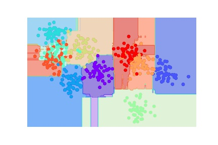

# Project 5: Making an AI

## 1. Table of Display

|                                Topic | Method         |
| -----------------------------------: | :------------- |
|                           What is ML | Summary        |
|                Intro to Scikit-Learn | Summary w/Code |
| Hyperparameters and Model Validation | ?              |
|                  Feature Engineering | ?              |
|            DTrees and Random Forests | ?              |
|              Face Detection Pipeline | Final Project  |

## 2. Table Of Contents

1. [1. Table of Display](#1-table-of-display)
2. [2. Table Of Contents](#2-table-of-contents)
3. [3. Background](#3-background)
   1. [3.1. What is Machine Learning?](#31-what-is-machine-learning)
      1. [3.1.1. Supervised learning](#311-supervised-learning)
         1. [3.1.1.1. Classification](#3111-classification)
         2. [3.1.1.2. Regression](#3112-regression)
      2. [3.1.2. Unspervised Learning](#312-unspervised-learning)
         1. [3.1.2.1. Clustering](#3121-clustering)
         2. [3.1.2.2. Dimensionality Reduction](#3122-dimensionality-reduction)
   2. [3.2. Scikit-Learn](#32-scikit-learn)
      1. [3.2.1. Data Represtientation](#321-data-represtientation)
      2. [3.2.2. Essentials of Scikit](#322-essentials-of-scikit)
         1. [3.2.2.1. Design Princaples](#3221-design-princaples)
         2. [3.2.2.2. Importing and Using Models](#3222-importing-and-using-models)
      3. [3.2.3. 3.3.Validating Models](#323-33validating-models)
      4. [3.2.4. Hyperparmeters](#324-hyperparmeters)
      5. [3.2.5. Holdout Sets](#325-holdout-sets)
   3. [3.3. Feature Engineering](#33-feature-engineering)
   4. [3.4. Special Topic: Random Forests](#34-special-topic-random-forests)
4. [4. Project: Face Detection Pipeline](#4-project-face-detection-pipeline)
   1. [4.1. Output](#41-output)
   2. [4.2. Code](#42-code)

## 3. Background

### 3.1. What is Machine Learning?

Machine Learning (ML) is the art of designing mathematical models of data that can be taught via tunable parameters. Because these algorithms are designed to asist in understanding data, there can be some debate of whether ML could be considered a branch of Artificial Intelligence (AI) anymore.

Because ML works with big data which vary greatly in both size, complexity there must also be various methods of analizing this data. The two general categories of ML are **Supervised** and **Unsupervised** learning. We will explorw these methods futher in this paper.

#### 3.1.1. Supervised learning

Supervised learning takes data and labels associated with the data to model their relationship. This ML model is used to apply labels to novel data. Supervised learning is commonly subdivided into **classification** and **regression**.

##### 3.1.1.1. Classification

Classification models use descrite categories such as a status. This type of model may be used to identify objects in an image or seek for when a part might be damaged within a piece of machinery.

This model will require the devleoper to fist make a labeled dataset. Then you must design model inputs and the general assumptions your can provide. After this you can provide a set of model paramters which can be adjusted by the model during the training stage. The end requlst is that when introduced to novel data the classical model will provide a predictive label.

##### 3.1.1.2. Regression

Regression models place their categories in a continuous spectrums. This can be used to seek the pobablity of damage to an piece of machinery or seek more complex relationships such as genetics to regions.

Regression models could be treadted as the oposite of [Demensionality Reduction](#3122-dimensionality-reduction) models. They will extract a new unknown relationship and create a new dimesion of labels.

#### 3.1.2. Unspervised Learning

Unsuprvised learning results from not having a labeled dataset. This type of learning is used to find relationships within a data set. Unspervised Learning can be further subdivided into **Clustering** and **Demensitionaly Reduction** models.

##### 3.1.2.1. Clustering

Clustering models act simlarly to classification models exceept they are seeking the distinct groups with the dataset. This can be used to seekout groups within massive datasets that humans may never see.

One method to do clustersing is through the _k_-means fits model. This method finds the center of data clusters, it must be profivided with a value _k_ or this value may be tunable. This model seeks the postion of centers that has the minimum distance between all points in the dataset.

##### 3.1.2.2. Dimensionality Reduction

Demensionality Reduction as its name suggests is designed to simpfly a data set into the smalled scturcure possible. This type of model could be used to seek important parameters to watch in larger systems which may take years for a human to analyze. This method allows us to infer new strutures that may not be labels (or may not exist).

A demnstionality reduction model typcially will remove one or more of the layers of data. This could be used to review a large dataset and place the data neatly into graphs that huamns and easily understand, interpret and apply.

### 3.2. Scikit-Learn

While developing a ML algrithem from scratch is possible it could be cumbersom and likly has already been done. Thus to prevent reinventing the wheel, you can use the modeule **Scikit-Learn**. Scikit-Learn contains many of the popular algorithems in one consitent API.

#### 3.2.1. Data Represtientation

Scikit-Learn descibes data with a _features matrix_ this mastrix can be stored in a NumPy array or Pandas DataFrame. The rows of the features matrix are often called sameles and the columns are considered features. Thus the features matrix is considered to have the shape `[n_samples, n_features]`.

The features matrix is then coupled with a _label array_. This array is typically is a Numpy array or Pandas Series of n_samples, but it can be two-dimesional with the shapre [n_smaple, n_targets]. The label array could be considered the dependent variable the model is attempting to predict.

#### 3.2.2. Essentials of Scikit

##### 3.2.2.1. Design Princaples

Scikit is designed to a _consitant_ API used for _inspection_ of data. It also procvides a simplistic _composition_ through the simplification of complex ML algorithms into their foundational parts. It also uses common data structures and provides excellent user-oriented defaults.

This results in the following workflow for algorithm design.

```Mermaid
graph TB
   A(Choose Class Model) --- B(Choose Hyperpamters)
   B --> C[Arrange Data into Features Matrix and Label Matrix]
   C --> D(Fit Model To Data)
   D --> E[Apply Model To new data]
```

##### 3.2.2.2. Importing and Using Models

Each model class is stored as a class within Scikit-Learn and are typically imported as a single object. For instance to import the _LinearRegression_ modle you would use

```python
from sklearn.linear_model import LinearRegression
```

This allows the user to then apply the model to a dataset throug the `.fit()` finction wchich runs most of your training. This is followed by using the `.predict()` function to predict the label or infer a property. If you are using an unsupervised model you also have the `.transform()` function available.
Below is a sample of how to use the LinearRegression model.

```python
## ALL THE IMPORTS
# IMPORTS
import matplotlib.pyplot as plt # PLOTING
import numpy as np # NUMPY
import pandas as pd # PANDAS
from sklearn.datasets import load_iris # Dataset
# Models
from sklearn.neighbors import KNeighborsClassifier
from sklearn.neighbors import RadiusNeighborsClassifier
from sklearn.linear_model import LinearRegression
# LOAD IRIS DATA
iris = load_iris()
X = iris.data
y = iris.target

# SETUP Linear Regression model
model_1 = LinearRegression(fit_intercept=True)
X = x[:, np.newaxis]
X.shape

model_1.fit(X, y)

xfit = np.linspace(-1, 11)
Xfit = xfit[:, np.newaxis]
yfit = model_1.predict(Xfit)
```

#### 3.2.3. 3.3.Validating Models

After selecting a model and selecting its hyperparameters you must then _validate_ the model. The two methods of model validation we will discus are **holdout sets** and **cross validation**. Once you have validated a model you must then select the best model by balancing the bias and variance of that model for the data you are using.

```python
# Model Validation Tools
from sklearn.model_selection import train_test_split
from sklearn.metrics import accuracy_score # Metrics for analysis

```

#### 3.2.4. Hyperparmeters

#### 3.2.5. Holdout Sets

### 3.3. Feature Engineering

### 3.4. Special Topic: Random Forests

There is a unique form of model called the **random forests** model. This model is is an _ensemble learning_ which uses simple dicision trees to calcualte its outcome.

A decision tree is a type of binary tree that uses a seires of decisions to select it out. This could be used to output your data in a unique manner. Below is an example of a simple decision tree to find the quadrant of the Cartesian plane a specific data point is in:


Esentially a Random Forest creates this decision tree for us. This makes random forests a excelent unserpervised classification model.

You can build the dicision tree through a _DecisionTreeClassifier_ which is under the sklearn.tree section. But when fitting you must be careful to avoid <ins>Over-fitting</ins>. Over-fitting is when your model becomes "Attached" to your data and will look at the specific data points. Luckally there is a simple solution. Use multiple instances of your model fit to similar or the same data points and use all of them to make the final decision. The second method with Decision Tree models is to uses the ensemle method _bagging_ which quickly creates multiple parrael decsion trees of data. The group of random decision trees is where we get random forests. Luckally sklearn.ensemble include the RnadomForestClassifier estimator which easily helps your form a random forest rapidly.

In addtion to classification using a `RandomForestClassifier` you can use a `RnadomForestRegressor` for regression. This type of model is excelent at detecting oscilating functions and does not need much instructions on that front.

Below is an example of how to use a RandomForestClassifier:

---

CODE:

```python
# %% Setup
from sklearn.datasets import make_blobs
from sklearn.ensemble import RandomForestClassifier as RandForClassy
import numpy as np
import matplotlib.pyplot as plt
import seaborn as sns
sns.set()

# %% Getting Data

X, y = make_blobs(500, 2, centers=10, cluster_std=1, random_state=1892)
ax = plt.ax
plt.scatter(X[:, 0], X[:, 1], c=y, cmap='jet')
plt.savefig('..\images\RAND_FOREST-CLASS-DATA.jpg')
# %% Helper Function From Text


def visualize_classifier(model, X, y, ax=None, cmap='rainbow'):
    ax = ax or plt.gca()  # Set the Plot axis

    # Plot the training points
    ax.scatter(X[:, 0], X[:, 1], c=y, s=30, cmap=cmap,
               clim=(y.min(), y.max()), zorder=3)  # Create a scatter plot of the data
    ax.axis('tight')  # Set the axis Range to tight
    ax.axis('off')  # Turn Off Axis Desplay
    xlim = ax.get_xlim()  # Get The X/Y LIMITS
    ylim = ax.get_ylim()

    # fit the estimator
    model.fit(X, y)  # Fit the model
    xx, yy = np.meshgrid(np.linspace(*xlim, num=200),
                         np.linspace(*ylim, num=200))  # Make grid of datapoints
    Z = model.predict(np.c_[xx.ravel(), yy.ravel()]).reshape(
        xx.shape)  # Use model to predict data

    # Create a color plot with the results
    n_classes = len(np.unique(y))
    contours = ax.contourf(xx, yy, Z, alpha=0.3,
                           levels=np.arange(n_classes + 1) - 0.5,
                           cmap=cmap, clim=(y.min(), y.max()),
                           zorder=1)

    ax.set(xlim=xlim, ylim=ylim)


# %% Setting UP and Running Module

model = RandForClassy(n_estimators=200)
visualize_classifier(model, X, y, cmap='seismic')
plt.savefig('..\images\RAND_FOREST-CLASS-MODEL_200.jpg')
model = RandForClassy(n_estimators=500)
visualize_classifier(model, X, y, cmap='rainbow')
plt.savefig('..\images\RNAD_FOREST-CLASS-MODEL_500.jpg')
# %%
```

The output looks like this




If you zoom into the image files you might notice that these models are albe to show a reagon to show the teal category that mixes within the red, yellow and blue categories. Sadly due to the image quality it is hard to tell how well the 500 group and 200 group system worked.

In the Electronic Warfare (EW) industy analyzing signals through noise is neccesary. Therefore a unquie cabability for Cognitive EW (CEW) is achived via Rand Forest Regression.

```python
### CEW EXAMPLE ###
# %% Setup
import matplotlib.pyplot as plt
import numpy as np
import seaborn as sns
from scipy.signal import sawtooth
from sklearn.datasets import make_blobs
from sklearn.ensemble import RandomForestRegressor as RandForRegy

sns.set()
rng = np.random.RandomState(420)
x = np.linspace(0, 12, 200)
# SIGNAL FUNCTION


def signal(x, noise_mult=1):
    base = np.sin(2*np.pi*x)
    saw = sawtooth(3*np.pi*x)
    noise_a = 0.5 * (np.random.randint(-90, 90, len(x))/100)
    noise_b = 0.2 * np.random.randint(0, 1) * np.cos(3*sawtooth(x)+base)
    noise = (noise_a + noise_b)
    return base + saw + noise*noise_mult


y = signal(x)


# %% SETTING UP/RUNNING OUT MODEL
model_200 = RandForRegy(200)
model_500 = RandForRegy(500)

model_200.fit(x[:, None], y)
model_500.fit(x[:, None], y)

y_fit_200 = model_200.predict(x[:, None])
y_fit_500 = model_500.predict(x[:, None])
# %% FILL OUT

plt.plot(x, y_fit_200, '--', linewidth=2)
plt.plot(x, y_fit_500, '-.', linewidth=2)
plt.plot(x, signal(x, noise_mult=0), alpha=0.4, c='red')
plt.errorbar(x, y, 0.5, fmt='o', alpha=0.1)
plt.legend()
plt.savefig('..\images\RAND_FOREST-REG-ALL.png')
# %%
```


You may notice that despite the noise the data actually does get the underlying siganl despite the noise.

## 4. Project: Face Detection Pipeline

### 4.1. Output

### 4.2. Code
